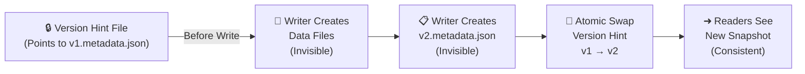
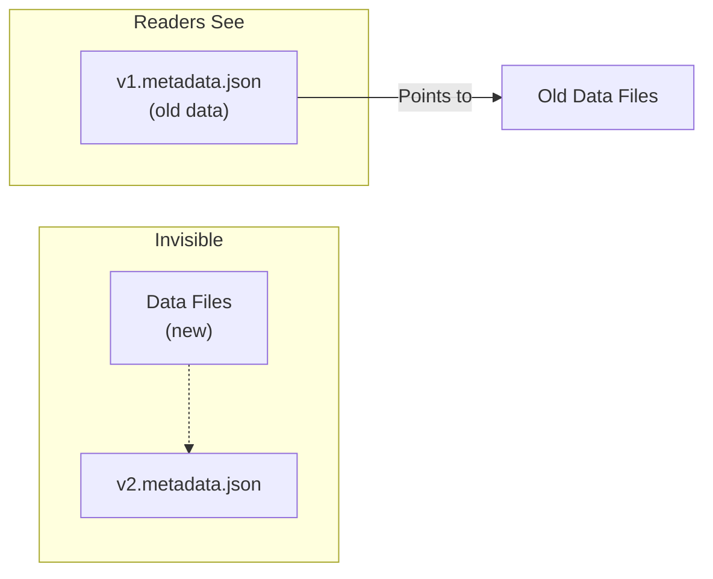
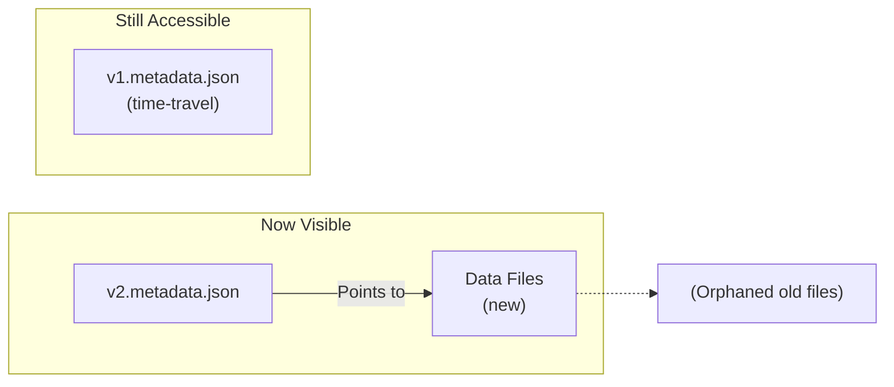
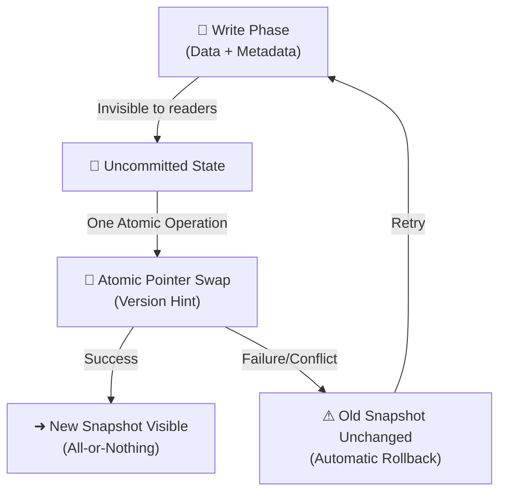
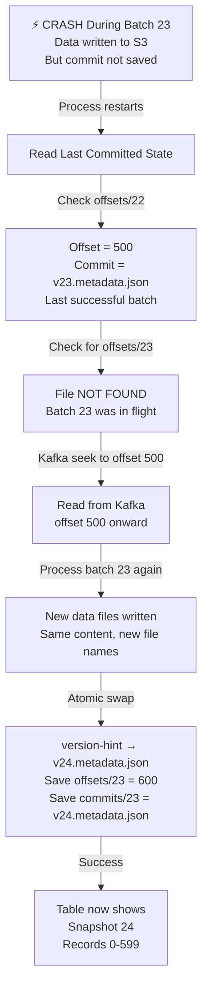
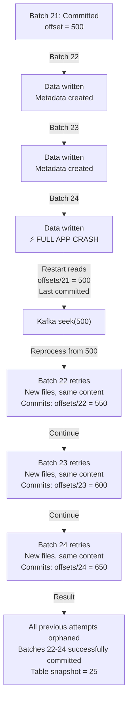
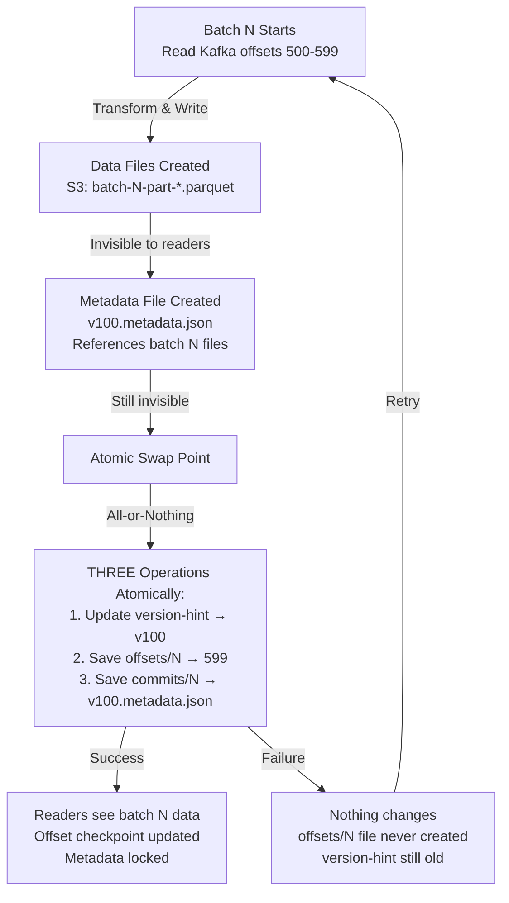
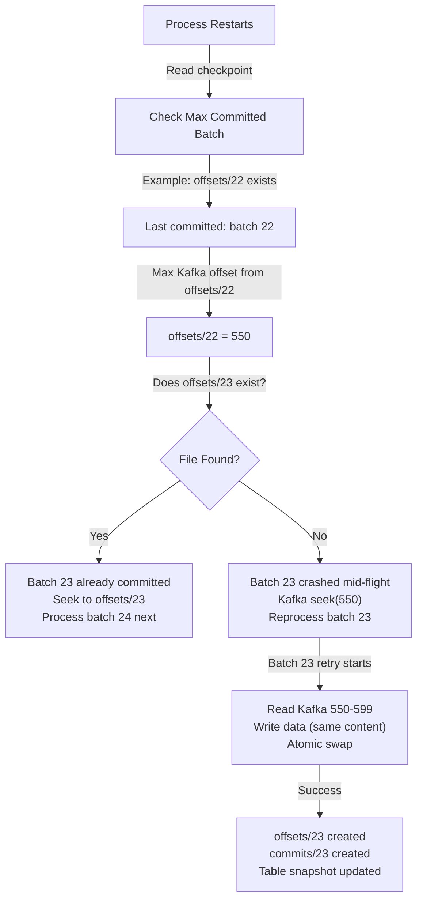
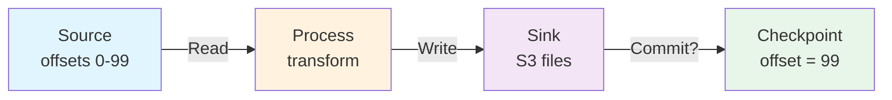
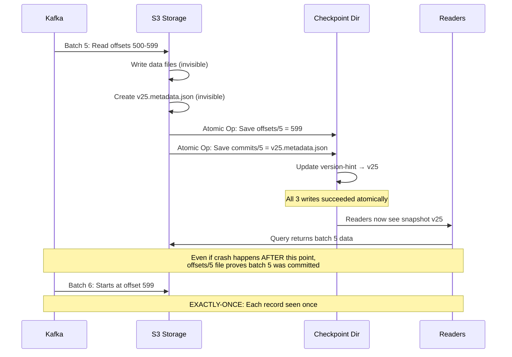

# How Apache Iceberg Achieves Atomic All-or-Nothing Writes

## The Problem: Distributed Data Consistency

Writing data reliably across distributed systems is hard. In traditional Hive-based data warehouses, the write process breaks down into two distinct phases:

1. **Write phase**: Data files land in object storage (S3, HDFS, etc.)
2. **Metadata update phase**: The Hive Metastore is updated to reflect the change

If a writer crashes between these phases, the system enters an inconsistent state. Data files exist but the metastore doesn't know about them. Readers might see stale data or no data at all. It's a nightmare.

**Apache Iceberg solves this with atomic pointer swaps** — a technique database engineers have used for decades.

---

## The Core Insight: The Pointer Swap (Atomic Commit)

###  Restaurant Menu System Analogy

Imagine managing a restaurant's menu:

**The problem**: You print 500 new menus with updated prices. Customers arrive while you're replacing old menus with new ones. Some see old prices, some see new prices. If interrupted, the restaurant is in chaos.

**The Iceberg solution**: Print all new menus in a back room. Keep one master menu at the front desk. When ready, swap the master menu once. All customers see the consistent new menu immediately. If you crash before the swap, the old menu stays intact.

---

**Iceberg uses the same principle: metadata is the single source of truth**.

---

## Iceberg's Atomic Write Architecture

### Step 1: Write Data Files (Invisible)

The writer creates new data files in object storage:

```
s3://my-bucket/warehouse/
├── data/
│   ├── [existing parquet files]
│   ├── 00001-abc123.parquet  ← NEW (invisible)
│   └── 00002-def456.parquet  ← NEW (invisible)
```

Here's the key: readers can't see these files yet. They're not referenced in any active metadata, so as far as the table is concerned, they don't exist.

---

### Step 2: Create Metadata File (Still Invisible)

The writer creates a new metadata file that describes the commit. This file contains:

- Which data files belong to this commit
- Schema information
- Statistics (row count, file size, null counts)
- Partition information
- Reference to the previous metadata file

```json
{
  "format-version": 2,
  "metadata-location": "s3://bucket/v2.metadata.json",
  "last-updated-ms": 1702156800000,
  "last-column-id": 10,
  "schema": { "fields": "..." },
  "current-snapshot-id": 5,
  "snapshots": [
    {
      "snapshot-id": 5,
      "timestamp-ms": 1702156800000,
      "summary": {
        "operation": "append",
        "added-data-files": 2,
        "added-rows": 150000
      },
      "manifest-list": "s3://bucket/v2.manifest-list.avro"
    }
  ],
  "refs": {
    "main": {
      "snapshot-id": 5
    }
  }
}
```

Again, this file is invisible. It's not yet the active snapshot, so readers don't know about it.

---

### Step 3: The Atomic Pointer Swap

This is the critical operation. Iceberg updates a version-hint file (or uses optimistic concurrency control) to atomically update the table's reference from old metadata to new metadata.

The pointer file (typically `version-hint.text` or database-backed) changes from:

```
v1.metadata.json
```

to:

```
v2.metadata.json
```

**This single atomic operation is the transaction boundary.** Nothing else matters — this is it.

Mermaid representation:



---

### Step 4: Readers Discover New Snapshot

When a reader queries the table, it:

1. Checks the version hint file to find the current metadata location
2. Reads that metadata file (e.g., `v2.metadata.json`)
3. Discovers the list of data files to read
4. Reads those data files

The reader sees a consistent snapshot because the metadata points to actual data files that exist.

---

## Fault Tolerance Scenarios

### Scenario 1: Writer Crashes Before Atomic Swap

Timeline:

```
Time  Event
----  -----
T1    Writer creates 00001-abc123.parquet
T2    Writer creates 00002-def456.parquet
T3    Writer creates v2.metadata.json
T4    ⚡ CRASH before swapping version hint
```

Result:
- Data files exist in S3 but are orphaned (not referenced)
- Metadata file exists but is not the active snapshot
- Version hint still points to v1.metadata.json
- Readers continue reading v1 (old data) — consistency is maintained
- Orphaned files can be cleaned up by a garbage collector

---

### Scenario 2: Pointer Swap Itself Fails (Conflict)

If two writers attempt concurrent commits:

```
Writer A                          Writer B
--------                          --------
Creates v2.metadata.json
Creates v3.metadata.json                    (concurrent)
                          
Attempts atomic swap
  Read version hint: v1
  CAS (compare-and-swap)           Attempts atomic swap
  ✅ SUCCESS (swap v1→v2)            Read version hint: v1
                                     CAS fails (already v2)
                                     ❌ CONFLICT
```

Result:
- Writer A succeeds, snapshot is now v2
- Writer B fails with a conflict exception
- Writer B must retry from scratch (read current snapshot, recompute, attempt commit again)
- Readers see one consistent snapshot — no partial writes

Iceberg's conflict resolution is database-like: **last write wins** (or writer must retry).

---

## How Iceberg Replaces Hive Metastore

Traditional Hive:

```sql
ALTER TABLE my_table ADD PARTITION (year=2024, month=12)
  LOCATION 's3://bucket/year=2024/month=12'
```

This updates the Hive Metastore with a new partition pointer.

**Iceberg replaces this:**

Hive Metastore now only points to **Iceberg's metadata location** (e.g., `s3://bucket/metadata/v2.metadata.json`).

The actual table structure, files, and snapshots are **entirely managed by Iceberg**, not Hive.

```
Hive Metastore:
┌─────────────────────────────┐
│ Table: my_table             │
│ Location: s3://bucket       │
│ Current Version: v2         │ ← Atomic pointer
└─────────────────────────────┘
         ↓
    v2.metadata.json (Iceberg manages)
         ↓
    ┌─────────────────────────────┐
    │ Snapshot #5                 │
    │ - manifest-list.avro        │
    │ - Data files: [...]         │
    │ - Statistics               │
    └─────────────────────────────┘
```

---

## Atomicity Guarantees in Detail

### Visibility Guarantees

**Before atomic swap:**



**After atomic swap:**



### Write Isolation

No writer can see another writer's uncommitted changes:

```
Writer A (Session 1)          Writer B (Session 2)
─────────────────            ─────────────────
Read v1.metadata.json
Compute changes
Write data files
Create v2.metadata.json
                               Read v1.metadata.json (v1 still current)
Attempt atomic swap
✅ Swap succeeded              Readers still see v1
(snapshot is now v2)
                               Compute changes
                               Write data files
                               Create v3.metadata.json
                               Attempt atomic swap
                               ✅ Swap succeeded
                               (snapshot is now v3)
```

**Key insight**: Each writer operates on a snapshot, not on live data.

---

## Why This Matters for Data Engineering

### Consistency Without Locks

Iceberg achieves **serializability without pessimistic locking** (no reader/writer locks).

Instead, it uses **optimistic concurrency control**:
- Writers assume their compute will succeed
- At the end, they detect conflicts during atomic swap
- On conflict, they retry

This is more efficient for distributed systems where lock timeouts are problematic.

### S3-Safe Atomicity

Traditional distributed databases require **consensus protocols** (Raft, Paxos) or **global locks**.

Iceberg uses only:
- **Atomic file writes** (S3 supports this with `PutObject`)
- **Atomic metadata updates** (version hint file or database transaction)

No distributed consensus needed!

### Support for Time Travel

Because metadata files are **immutable and versioned**, readers can query old snapshots:

```scala
// Read current version
spark.read.iceberg("my_table").show()

// Read as of specific time
spark.read.iceberg("my_table").asOfTimestamp("2024-12-01T10:00:00Z").show()

// Read specific snapshot
spark.read.iceberg("my_table").option("snapshot-id", 3).show()
```

---

## Summary: The Atomic Guarantee in One Diagram



---

---

## Streaming Checkpoints vs. Iceberg Commits

### The Old Problem: Offset Management Without ACID

Traditional streaming systems (Kafka + Hive/Parquet) had a critical problem:

```
Checkpoint stored: offset = 1000

Batch processing:
  1. Read records 0-999 from Kafka
  2. Write data files to S3
  3. Update offset to 1000 in checkpoint
  
If crash at step 2: data written but offset not updated → duplicate reads
If crash at step 3: offset updated but data lost → data gaps
```

Two independent operations, two points of failure.

### How Iceberg Solves This: Atomic Metadata + Offsets

With Iceberg streaming, the checkpoint location stores **both**:

```
Checkpoint directory:
├── offsets/
│   └── 0  (offset = 1000, batch 5)
├── v1.metadata.json (old snapshot)
├── v2.metadata.json (new snapshot with data from batch 5)
└── ...
```

**The key difference**: Offset and commit are **in the same atomic operation**.

```
// Pseudo-code: Iceberg streaming commit
commitBatch(batchId: Long, records: DataFrame, maxOffset: Long):
  // Step 1: Write data (invisible)
  manifestList = writeDataFiles(records)
  
  // Step 2: Create new metadata with manifest pointer (still invisible)
  newMetadata = createMetadata(manifestList)
  
  // Step 3: ATOMIC - Update pointer AND offset in one operation
  atomicSwap(
    oldMetadata = v1.metadata.json,
    newMetadata = v2.metadata.json,
    offsetCheckpoint = maxOffset
  )
```

Either **both succeed or both fail** — no middle ground.

---

## What Happens During a Single Batch Failure

### Scenario: Stream Crashes Mid-Batch

```
Timeline:
T1    Batch 5 starts, read records 950-1050
T2    Batch 5 writes 50 parquet files (invisible)
T3    Batch 5 creates v5.metadata.json (still invisible)
T4    ⚡ CRASH during atomic swap to v5.metadata.json
T5    Process restarts
```

**Result:**
- v4.metadata.json still active (readers see up to record 949)
- Batch 5 data files are orphaned in S3 (unreferenced, invisible)
- Offset checkpoint still at 950

**On restart:**
```
1. Read checkpoint: last committed offset = 950
2. Kafka seek to offset 950
3. Batch 5 retries: read records 950-1050
4. Write new parquet files (different file names than before)
5. Atomic swap succeeds this time
6. Readers now see data through record 1050
```

**Zero data loss. Zero duplicates.** Even if the crash happened 100 times, restart always gets it right.

---

## What Happens During Full Application Restart

### Scenario: Entire Streaming App Crashes

```
Timeline:
T1    App running: batches 1-50 already committed
T2    Batch 51: read 5000 records, write 100 parquet files
T3    Batch 52: read 5000 records, write 100 parquet files
T4    ⚡ ENTIRE APP CRASHES (both batches mid-flight)
      - Batch 51 data: ORPHANED (no v51.metadata.json)
      - Batch 52 data: ORPHANED (no v52.metadata.json)
      - Checkpoint: still at batch 50, offset 50000
T5    App restarts after 1 hour
```

**Result:**
- Only v50.metadata.json is active
- Readers see data through offset 50000
- Batches 51-52 data sits invisible in S3

**On restart:**
```
1. Last committed snapshot = 50, offset = 50000
2. Kafka seek to offset 50000
3. Batch 51 starts fresh (with new file names)
4. Batch 52 starts fresh
5. Both process independently (no conflict with orphaned files)
6. Both eventually commit successfully
```

**Old systems would:**
- Have half-written data interleaved with offsets
- Not know if records 50000-55000 were processed or not
- Risk re-reading duplicates or skipping records on restart

**Iceberg guarantees:**
- Exactly which records were committed (checkpoint offset)
- Exactly which data belongs to those records (metadata snapshot)
- Orphaned files never interfere with new writes

---

## Multi-Sink Streaming (The Hard Case)

### Scenario: Write to 5 Sinks in One Batch

In older Spark Structured Streaming, this was problematic:

```scala
// BAD: Spark writeStream with multiple sinks
parsed.writeStream.to("sink1").start()  // Query 1
parsed.writeStream.to("sink2").start()  // Query 2
parsed.writeStream.to("sink3").start()  // Query 3
parsed.writeStream.to("sink4").start()  // Query 4
parsed.writeStream.to("sink5").start()  // Query 5
```

Each is **independent**:
- Sink 1 commits batch 5 at offset 5000 ✓
- Sink 2 commits batch 5 at offset 5001 (one behind!)
- Sink 3 crashes mid-batch, commits fail
- Sink 4 retries from offset 4999 (duplicate!)
- Sink 5 never sees batch 5

Different sinks see different versions of the data. Chaos.

### Iceberg Solution: Single Checkpoint, Multiple Outputs

```scala
// GOOD: Iceberg foreachBatch with atomic commit
stream.writeStream.foreachBatch { (batchDF, batchId) =>
  // Single read from Kafka, single parse
  val parsed = transformOnce(batchDF)
  
  // Split to multiple outputs
  val sink1Data = parsed.select("field1", "field2")
  val sink2Data = parsed.select("field3", "field4")
  val sink3Data = parsed.select("field5", "field6")
  val sink4Data = parsed.select("field7", "field8")
  val sink5Data = parsed.select("field9", "field10")
  
  // All writes happen in single batch
  sink1Data.write.mode("append").saveToIceberg("table1")
  sink2Data.write.mode("append").saveToIceberg("table2")
  sink3Data.write.mode("append").saveToIceberg("table3")
  sink4Data.write.mode("append").saveToIceberg("table4")
  sink5Data.write.mode("append").saveToIceberg("table5")
}
```

**If any sink fails:**
```
Sink 1: writes succeed (invisible)
Sink 2: writes succeed (invisible)
Sink 3: ⚡ CRASH before atomic metadata swap
Sink 4: writes pending
Sink 5: writes pending

Result:
- NONE of the tables are updated
- All 5 are still at their previous snapshot
- Checkpoint still at batch 4
- On restart: batch 5 retries
- Either ALL 5 tables get batch 5, or NONE do
```

This is **atomicity across multiple tables** — impossible before Iceberg.

---

## Checkpoint Location Structure

Understanding what Iceberg stores in the checkpoint directory:

```
s3://my-bucket/warehouse/my_table/.iceberg/
├── metadata/
│   ├── v1.metadata.json
│   ├── v2.metadata.json
│   ├── v3.metadata.json
│   └── ... (immutable, versioned history)
│
├── version-hint.text
│   └── Contains: "3" (current version is v3.metadata.json)
│
└── offsets/
    ├── 0  (batch 1: offset = 100)
    ├── 1  (batch 2: offset = 200)
    ├── 2  (batch 3: offset = 300)
    └── 3  (batch 4: offset = 400)
```

**Key insight**: Offsets are **tied to metadata versions** by batch ID.

When Iceberg atomically swaps metadata, it **simultaneously** writes the offset:

```
Before commit: version-hint = "v2", offsets/2 = 300
After commit:  version-hint = "v3", offsets/3 = 400

Recovery: read version-hint = "v3", lookup offsets/3 = 400
Result: Know exactly which Kafka offsets are in v3
```

---

### The Actual Checkpoint Directory on Disk

Here's what your streaming checkpoint looks like after 4 successful batches:

```
.checkpoint/
├── offsets/
│   ├── 0
│   │   └── contents: 100
│   ├── 1
│   │   └── contents: 200
│   ├── 2
│   │   └── contents: 300
│   └── 3
│   │   └── contents: 400
│
├── commits/
│   ├── 0
│   │   └── contents: v1.metadata.json (snapshot 1)
│   ├── 1
│   │   └── contents: v2.metadata.json (snapshot 2)
│   ├── 2
│   │   └── contents: v3.metadata.json (snapshot 3)
│   └── 3
│   │   └── contents: v4.metadata.json (snapshot 4)
│
└── batchMetadata/
    ├── 0.json → {"batchId": 0, "offset": 100, "timestamp": ...}
    ├── 1.json → {"batchId": 1, "offset": 200, "timestamp": ...}
    ├── 2.json → {"batchId": 2, "offset": 300, "timestamp": ...}
    └── 3.json → {"batchId": 3, "offset": 400, "timestamp": ...}
```

Each batch creates:
1. An **offset file** - stores the max Kafka offset processed
2. A **commit file** - stores the metadata snapshot version that was committed
3. **Batch metadata** - tracks which records went into which snapshot

---

### Recovery Scenario: Offset 23, Last Commit 22

Let me show what happens on restart when a crash occurs mid-batch:



**Detailed view of what's happening:**

```
On Crash at Batch 23:
══════════════════════

Checkpoint state on disk:
├── offsets/22 → 500        ← Last committed offset
├── commits/22 → v23.metadata.json
└── offsets/23 → DOES NOT EXIST (batch 23 in flight)

S3 state:
└── s3://bucket/warehouse/data/
    ├── batch-22-part-0.parquet (committed)
    ├── batch-22-part-1.parquet (committed)
    ├── batch-23-part-0.parquet (⚡ ORPHANED, not in metadata)
    └── batch-23-part-1.parquet (⚡ ORPHANED, not in metadata)

Version hint still points to v23.metadata.json (not updated)


On Restart:
═══════════

1. Read checkpoint directory:
   max_committed_batch = 22
   last_offset = 500
   
2. Check: does offsets/23 exist?
   NO → batch 23 was never committed
   
3. Kafka seek(500):
   Start reading from offset 500 onward
   
4. Batch 23 processing (SECOND ATTEMPT):
   Read Kafka records 500-599 (same as first attempt)
   Write new parquet files:
     - batch-23-part-0.parquet (new file names with deterministic hash)
     - batch-23-part-1.parquet
   
5. Atomic commit:
   ├─ Write v24.metadata.json (includes new batch-23 files)
   ├─ Save offsets/23 → 600
   ├─ Save commits/23 → v24.metadata.json
   └─ Update version-hint → v24.metadata.json
   
6. Result:
   ├─ Readers see snapshot 24
   ├─ Table contains records 0-599
   └─ Orphaned batch-23 files from first attempt are garbage collected
```

This is the **exactly-once guarantee in action**.

---

### Multi-Batch Restart: What If Batches 22, 23, 24 Were In-Flight



---

### The Commit Directory Deep Dive

After 25 batches, your commit history looks like:

```
commits/
├── 0  → v1.metadata.json
├── 1  → v2.metadata.json
├── 2  → v3.metadata.json
...
├── 21 → v22.metadata.json
├── 22 → v23.metadata.json  (batch 22 created snapshot 23)
├── 23 → v24.metadata.json  (batch 23 created snapshot 24)
├── 24 → v25.metadata.json  (batch 24 created snapshot 25)
└── ... (continuing up to current)
```

Each commit file contains:
```json
{
  "batch-id": 23,
  "snapshot-id": 24,
  "metadata-version": "v24.metadata.json",
  "kafka-offset": 600,
  "timestamp": "2024-12-09T10:15:32Z",
  "data-files": [
    "batch-23-part-0-abc123.parquet",
    "batch-23-part-1-def456.parquet"
  ],
  "row-count": 100000,
  "status": "committed"
}
```

When a stream restarts:
1. Find the **highest batch ID** in the `commits/` directory
2. That tells us which Kafka offset to seek to
3. Continue from there with the next batch


## Failover Scenarios: Iceberg vs. Previous Tech

### Scenario 1: Single Executor Fails in Multi-Executor Batch

**Old tech (Spark + Hive partitions):**
```
Executor 1: writes records 0-2500 to s3://bucket/part-0.parquet ✓
Executor 2: writes records 2500-5000 to s3://bucket/part-1.parquet ✓
Executor 3: ⚡ CRASHES writing records 5000-7500
             part-2.parquet is half-written (corrupt)

Offset committed to Hive: records 0-7500

Result:
- Records 0-5000 readable
- Records 5000-7500 unreadable (corrupt file)
- Offset says 7500 are safe (LIE)
- Next batch starts from 7500, so 5000-7500 are skipped forever
```

**Iceberg:**
```
Executor 1: writes 0-2500, creates manifest entry (invisible)
Executor 2: writes 2500-5000, creates manifest entry (invisible)
Executor 3: ⚡ CRASHES mid-write

All executor outputs are invisible (not in metadata yet)

Atomic swap fails (coordinator sees incomplete manifest)

Result:
- Metadata still points to previous snapshot
- Offset still at previous batch
- On restart: batch retries completely
- No data loss, no corruption, no skipped records
```

### Scenario 2: Network Partition During Commit

**Old tech:**
```
Commit phase:
1. Update Hive Metastore: ALTER TABLE ADD PARTITION
   - Network times out
   - Metastore sees partial update

Readers see: inconsistent partition list
Some readers: see partition
Some readers: don't see partition
```

**Iceberg:**
```
Commit phase:
1. Atomic swap: write v3.metadata.json, update version-hint atomically
   - S3 network partitions
   - Some metadata files written, but version-hint swap fails

Result:
- v3.metadata.json orphaned in S3 (unreferenced)
- version-hint still points to v2.metadata.json
- ALL readers: see v2.metadata.json (consistent)
- On network recovery: coordinator retries swap
  - Either succeeds and v3 becomes visible
  - Or times out and coordinator rolls back
  - Never a "partially visible" state
```

### Scenario 3: Coordinator Crashes After Metadata Swap, Before Writing Offset

**Old tech (hard to reason about):**
```
1. Data written to multiple locations
2. Hive metastore updated
3. Coordinator crashes before offset checkpoint
4. Restart reads offset = old_value
5. Re-processes same batch
6. Data duplicated in table
```

**Iceberg:**
```
1. Data written (invisible)
2. Metadata created (invisible)
3. Atomic swap: version pointer AND offset updated together
4. Coordinator crashes after swap
5. Restart reads version-hint = v3, offset = 400
6. Both are consistent
7. Re-reads from offset 400, produces same data
8. Data is idempotent on re-commit (same records, same file names)
```

The atomic swap means **metadata and offset are never out of sync**.

---

## Idempotency: The Secret Weapon

Iceberg's streaming is **idempotent by design**. If a batch runs twice:

```
Batch 5 (first run):
- Kafka offset 500-599
- Generates file: 2024-12-09-batch-5-part-0.parquet
- Writes to Iceberg table
- Metadata snapshot includes this file

Batch 5 (second run, after restart):
- Kafka offset 500-599 (same offsets!)
- Generates file: 2024-12-09-batch-5-part-0.parquet (same file name!)
- Attempts write to Iceberg table

Result:
- Iceberg detects: file already in metadata
- Skips duplicate write
- Commit succeeds (no error)
```

This is why Iceberg is safer than Delta Lake or Hive for streaming:
- **Delta**: requires expensive merges to handle duplicates
- **Hive**: has no deduplication (data gets duplicated)
- **Iceberg**: atomic writes prevent duplicates at the source

---

## Summary: Checkpoint Consistency with Iceberg

```
┌─────────────────────────────────────────────────┐
│ Streaming Checkpoint at Atomic Swap             │
├─────────────────────────────────────────────────┤
│                                                 │
│  Before swap:                                   │
│  ├─ Checkpoint: offset = 1000, batch = 5       │
│  └─ Data: invisible in S3                       │
│                                                 │
│  During swap (atomic):                          │
│  ├─ Write version-hint ← v6.metadata.json       │
│  ├─ Write offsets/5 ← 1000                      │
│  └─ Both succeed or both fail (no middle state) │
│                                                 │
│  After swap:                                    │
│  ├─ Checkpoint: offset = 1000, batch = 5       │
│  ├─ Data: readers now see records 0-999        │
│  └─ Guaranteed: offset = records visible       │
│                                                 │
└─────────────────────────────────────────────────┘
```

Key differences from previous tech:

| Aspect | Spark + Hive | Delta Lake | Iceberg |
|--------|------------|-----------|---------|
| Data write & offset atomic? | No | Merge needed | Yes |
| Multi-sink consistency? | No | Partial | Yes |
| Orphaned files cleanup? | Manual | Eventual | Automatic |
| Duplicate handling on retry? | Duplicates occur | Must dedupe | Idempotent |
| Checkpoint-to-data drift? | Common | Possible | Never |

## Key Takeaways

1. **Iceberg separates data writes from metadata commits**
   - Data files written first (invisible)
   - Metadata created next (still invisible)
   - Atomic pointer swap last (single source of truth)

2. **The version hint file is the transaction boundary**
   - Changing this pointer atomically is the entire transaction
   - No partial writes visible to readers

3. **Faults before the swap are safe**
   - Data files become orphaned but are invisible
   - Readers see consistent old snapshot
   - Cleanup jobs later remove orphaned files

4. **Conflicts during swap are detected and handled**
   - CAS (compare-and-swap) ensures only one writer wins
   - Losers see a conflict exception and retry
   - No reader ever sees a partial write

5. **This enables true ACID semantics on object storage**
   - Without distributed consensus
   - Without global locks
   - With time-travel as a bonus feature

6. **Streaming checkpoints are atomic with data commits**
   - Offset and metadata version always in sync
   - Batch retries are safe and idempotent
   - Multi-sink writes are all-or-nothing

7. **Failover scenarios are robust**
   - Single executor crashes: no data loss
   - Full app crashes: batch retries cleanly
   - Network partitions: metadata stays consistent
   - Duplicates on retry: handled automatically


## Exactly-Once Semantics: How Iceberg and Spark Structured Streaming Achieve It

The gold standard for streaming systems is **exactly-once** semantics: each record is processed and written **exactly one time**, no duplicates, no skips.

### The Challenge

Most systems achieve only **at-least-once** or **at-most-once**:

- **At-least-once**: If a crash happens, replay the batch. Problem: duplicates if offset was updated before crash
- **At-most-once**: Don't replay, skip it. Problem: data loss

Achieving **exactly-once** requires coordinating three operations atomically:
1. Read from source (Kafka) at offset X
2. Write data to sink (S3/Iceberg)
3. Commit offset X

If any fails, all must fail. If any succeeds, all must succeed.

### Iceberg's Exactly-Once Architecture



The key is: **offset is written in the same atomic operation as metadata**.

### Checkpoint Directory State Before and After Atomic Swap

**BEFORE atomic swap (batch 22 in flight):**

```
.checkpoint/
├── offsets/
│   ├── 20 → 450
│   └── 21 → 500
│
├── commits/
│   ├── 20 → v21.metadata.json
│   └── 21 → v22.metadata.json
│
└── In-Flight Data (Batch 22):
    ├── Data files written to S3 (orphaned)
    ├── v23.metadata.json created (unreferenced)
    └── offsets/22 NOT YET WRITTEN
```

**AFTER atomic swap (batch 22 committed):**

```
.checkpoint/
├── offsets/
│   ├── 20 → 450
│   ├── 21 → 500
│   └── 22 → 550          ← APPEARED ATOMICALLY
│
├── commits/
│   ├── 20 → v21.metadata.json
│   ├── 21 → v22.metadata.json
│   └── 22 → v23.metadata.json     ← APPEARED ATOMICALLY
│
└── S3 readers can now see:
    Snapshot v23 with batch 22 data
```

The critical insight: **offsets/22 and commits/22 appear together, atomically, or not at all**.

### Recovery Decision Tree



### Why This Is Exactly-Once (Not At-Least-Once)

The traditional streaming architecture (Spark + Kafka + Parquet + Hive):

```
Spark reads: offsets 0-99 ✓
Spark writes: part-0.parquet ✓
Hive metastore updates: partition added ✓
Offset checkpoint: 100  ⚡ CRASH HERE

On restart:
- Partition exists (readers see it)
- Offset is still 0 (retry logic restarts at 0)
- Result: records 0-99 READ TWICE
  → AT-LEAST-ONCE (duplicates)
```

Iceberg's approach (offset + metadata atomic):

```
Iceberg reads: offsets 0-99 ✓
Iceberg writes: data files ✓
Iceberg writes: v1.metadata.json ✓
ATOMIC SWAP STARTS:
  - Update version-hint ✓
  - Write offsets/0 = 99 ✓
  - Write commits/0 = v1.metadata.json ✓
ATOMIC SWAP COMPLETE
  ⚡ CRASH HERE (too late, already committed)

On restart:
- offsets/0 exists → batch 0 definitely committed
- commits/0 exists → snapshot definitely exists
- Kafka seek(99) → read next batch starting at 100
- Result: records 0-99 READ EXACTLY ONCE
  → EXACTLY-ONCE (no duplicates)
```

### The Three Guarantees

Let's visualize how each guarantee differs:



**At-Most-Once (lose data):**
```
Crash during write?
→ Restart seeks to offset 100
→ Records 0-99 never re-attempted
→ Data permanently lost
```

**At-Least-Once (duplicates):**
```
Crash after write, before checkpoint?
→ Restart seeks to offset 0 (checkpoint says 0)
→ Re-read and re-write records 0-99
→ Now in sink TWICE
→ Duplicates in table
```

**Exactly-Once (Iceberg):**
```
Crash any time?
→ Restart checks: is checkpoint file for this batch there?
→ If yes: offset and snapshot BOTH exist → skip to next batch
→ If no: offset file missing → this batch incomplete → retry
→ Atomic swap ensures they appear or disappear together
→ NO duplicates, NO data loss
```

### Spark Structured Streaming's Exactly-Once with Iceberg

Spark Structured Streaming achieves exactly-once through a similar pattern:

```scala
streamingDF.writeStream
  .option("checkpointLocation", "/path/to/checkpoint")
  .foreachBatch { (batchDF, batchId) =>
    
    batchDF.write
      .mode("append")
      .format("iceberg")
      .save("my_table")
    
  }
  .start()
```

Behind the scenes, Spark does:

```
For each micro-batch:
  
1. Read from Kafka (offsets tracked internally)
2. Transform (deterministic = same output if re-run)
3. Write to Iceberg table:
   - Create manifest files (invisible)
   - Create metadata snapshot (invisible)
4. Atomic swap (version-hint + offset + batch metadata)
5. If swap succeeds:
   - Checkpoint record saved to disk
   - Next batch starts from new offset
6. If swap fails:
   - Checkpoint not saved
   - Next restart retries this batch
   - Same input → same output (idempotent)
   → Exactly-once achieved
```

The **deterministic output** is crucial. Batch N must produce identical data every time it runs with the same input offsets. Iceberg helps here because:

- File names are deterministic (based on offset range)
- Data in files is identical (same transformation)
- If retry writes same file: Iceberg deduplicates
- No double-writing

### Mermaid: End-to-End Exactly-Once Flow



### Why Not Just Use Spark + Hive?

Old architecture vs. new:

```
OLD (Spark + Hive Partitions):
┌──────────────────────────────────┐
│ Batch Processing                 │
├──────────────────────────────────┤
│ 1. Read Kafka offsets 0-99       │
│ 2. Write to s3://data/part-0     │
│ 3. INSERT INTO table PARTITION   │ ← Hive metastore call
│ 4. Write offset checkpoint       │ ← Separate operation
│                                  │
│ Problem: 2 independent ops (#3, #4)
│ Crash between them = mess        │
└──────────────────────────────────┘

NEW (Spark + Iceberg):
┌──────────────────────────────────┐
│ Batch Processing                 │
├──────────────────────────────────┤
│ 1. Read Kafka offsets 0-99       │
│ 2. Write to s3://data/...        │
│ 3. Create v5.metadata.json       │
│ 4. ATOMIC: Swap version-hint +   │
│    Save offsets + Save commits   │
│                                  │
│ Advantage: Single atomic op      │
│ All-or-nothing guarantee         │
└──────────────────────────────────┘
```
