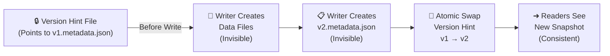
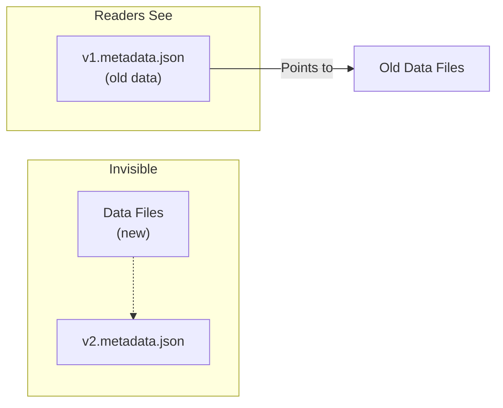
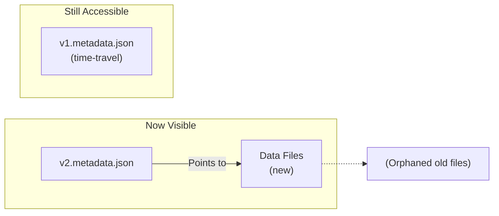
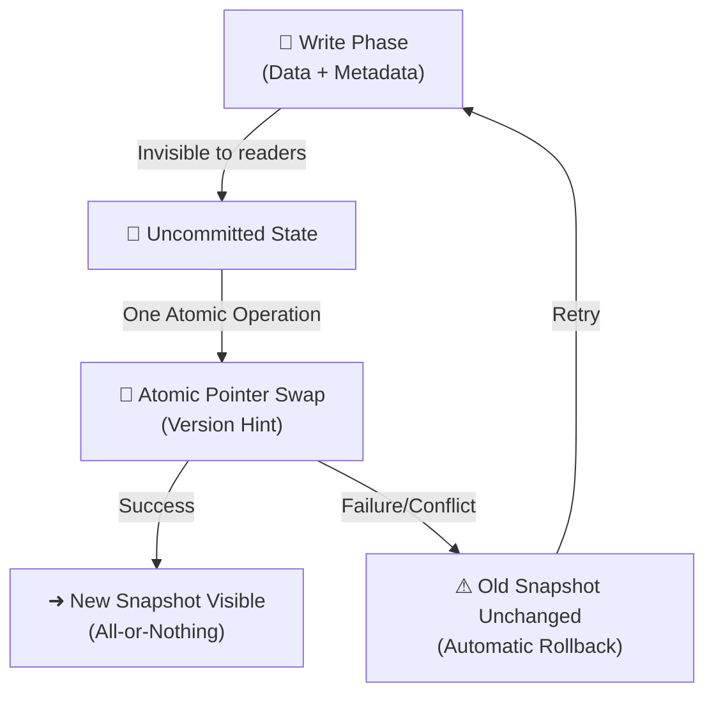

# How Apache Iceberg Achieves Atomic All-or-Nothing Writes

## The Problem: Distributed Data Consistency

Writing data reliably across distributed systems is hard. In traditional Hive-based data warehouses, the write process breaks down into two distinct phases:

1. **Write phase**: Data files land in object storage (S3, HDFS, etc.)
2. **Metadata update phase**: The Hive Metastore is updated to reflect the change

If a writer crashes between these phases, the system enters an inconsistent state. Data files exist but the metastore doesn't know about them. Readers might see stale data or no data at all. It's a nightmare.

**Apache Iceberg solves this with atomic pointer swaps** — a technique database engineers have used for decades.

---

## The Core Insight: The Pointer Swap (Atomic Commit)

###  Restaurant Menu System Analogy

Imagine managing a restaurant's menu:

**The problem**: You print 500 new menus with updated prices. Customers arrive while you're replacing old menus with new ones. Some see old prices, some see new prices. If interrupted, the restaurant is in chaos.

**The Iceberg solution**: Print all new menus in a back room. Keep one master menu at the front desk. When ready, swap the master menu once. All customers see the consistent new menu immediately. If you crash before the swap, the old menu stays intact.

---

**Iceberg uses the same principle: metadata is the single source of truth**.

---

## Iceberg's Atomic Write Architecture

### Step 1: Write Data Files (Invisible)

The writer creates new data files in object storage:

```
s3://my-bucket/warehouse/
├── data/
│   ├── [existing parquet files]
│   ├── 00001-abc123.parquet  ← NEW (invisible)
│   └── 00002-def456.parquet  ← NEW (invisible)
```

Here's the key: readers can't see these files yet. They're not referenced in any active metadata, so as far as the table is concerned, they don't exist.

---

### Step 2: Create Metadata File (Still Invisible)

The writer creates a new metadata file that describes the commit. This file contains:

- Which data files belong to this commit
- Schema information
- Statistics (row count, file size, null counts)
- Partition information
- Reference to the previous metadata file

```json
{
  "format-version": 2,
  "metadata-location": "s3://bucket/v2.metadata.json",
  "last-updated-ms": 1702156800000,
  "last-column-id": 10,
  "schema": { "fields": "..." },
  "current-snapshot-id": 5,
  "snapshots": [
    {
      "snapshot-id": 5,
      "timestamp-ms": 1702156800000,
      "summary": {
        "operation": "append",
        "added-data-files": 2,
        "added-rows": 150000
      },
      "manifest-list": "s3://bucket/v2.manifest-list.avro"
    }
  ],
  "refs": {
    "main": {
      "snapshot-id": 5
    }
  }
}
```

Again, this file is invisible. It's not yet the active snapshot, so readers don't know about it.

---

### Step 3: The Atomic Pointer Swap

This is the critical operation. Iceberg updates a version-hint file (or uses optimistic concurrency control) to atomically update the table's reference from old metadata to new metadata.

The pointer file (typically `version-hint.text` or database-backed) changes from:

```
v1.metadata.json
```

to:

```
v2.metadata.json
```

**This single atomic operation is the transaction boundary.** Nothing else matters — this is it.

Mermaid representation:



---

### Step 4: Readers Discover New Snapshot

When a reader queries the table, it:

1. Checks the version hint file to find the current metadata location
2. Reads that metadata file (e.g., `v2.metadata.json`)
3. Discovers the list of data files to read
4. Reads those data files

The reader sees a consistent snapshot because the metadata points to actual data files that exist.

---

## Fault Tolerance Scenarios

### Scenario 1: Writer Crashes Before Atomic Swap

Timeline:

```
Time  Event
----  -----
T1    Writer creates 00001-abc123.parquet
T2    Writer creates 00002-def456.parquet
T3    Writer creates v2.metadata.json
T4    ⚡ CRASH before swapping version hint
```

Result:
- Data files exist in S3 but are orphaned (not referenced)
- Metadata file exists but is not the active snapshot
- Version hint still points to v1.metadata.json
- Readers continue reading v1 (old data) — consistency is maintained
- Orphaned files can be cleaned up by a garbage collector

---

### Scenario 2: Pointer Swap Itself Fails (Conflict)

If two writers attempt concurrent commits:

```
Writer A                          Writer B
--------                          --------
Creates v2.metadata.json
Creates v3.metadata.json                    (concurrent)
                          
Attempts atomic swap
  Read version hint: v1
  CAS (compare-and-swap)           Attempts atomic swap
  ✅ SUCCESS (swap v1→v2)            Read version hint: v1
                                     CAS fails (already v2)
                                     ❌ CONFLICT
```

Result:
- Writer A succeeds, snapshot is now v2
- Writer B fails with a conflict exception
- Writer B must retry from scratch (read current snapshot, recompute, attempt commit again)
- Readers see one consistent snapshot — no partial writes

Iceberg's conflict resolution is database-like: **last write wins** (or writer must retry).

---

## How Iceberg Replaces Hive Metastore

Traditional Hive:

```sql
ALTER TABLE my_table ADD PARTITION (year=2024, month=12)
  LOCATION 's3://bucket/year=2024/month=12'
```

This updates the Hive Metastore with a new partition pointer.

**Iceberg replaces this:**

Hive Metastore now only points to **Iceberg's metadata location** (e.g., `s3://bucket/metadata/v2.metadata.json`).

The actual table structure, files, and snapshots are **entirely managed by Iceberg**, not Hive.

```
Hive Metastore:
┌─────────────────────────────┐
│ Table: my_table             │
│ Location: s3://bucket       │
│ Current Version: v2         │ ← Atomic pointer
└─────────────────────────────┘
         ↓
    v2.metadata.json (Iceberg manages)
         ↓
    ┌─────────────────────────────┐
    │ Snapshot #5                 │
    │ - manifest-list.avro        │
    │ - Data files: [...]         │
    │ - Statistics               │
    └─────────────────────────────┘
```

---

## Atomicity Guarantees in Detail

### Visibility Guarantees

**Before atomic swap:**



**After atomic swap:**



### Write Isolation

No writer can see another writer's uncommitted changes:

```
Writer A (Session 1)          Writer B (Session 2)
─────────────────            ─────────────────
Read v1.metadata.json
Compute changes
Write data files
Create v2.metadata.json
                               Read v1.metadata.json (v1 still current)
Attempt atomic swap
✅ Swap succeeded              Readers still see v1
(snapshot is now v2)
                               Compute changes
                               Write data files
                               Create v3.metadata.json
                               Attempt atomic swap
                               ✅ Swap succeeded
                               (snapshot is now v3)
```

**Key insight**: Each writer operates on a snapshot, not on live data.

---

## Why This Matters for Data Engineering

### Consistency Without Locks

Iceberg achieves **serializability without pessimistic locking** (no reader/writer locks).

Instead, it uses **optimistic concurrency control**:
- Writers assume their compute will succeed
- At the end, they detect conflicts during atomic swap
- On conflict, they retry

This is more efficient for distributed systems where lock timeouts are problematic.

### S3-Safe Atomicity

Traditional distributed databases require **consensus protocols** (Raft, Paxos) or **global locks**.

Iceberg uses only:
- **Atomic file writes** (S3 supports this with `PutObject`)
- **Atomic metadata updates** (version hint file or database transaction)

No distributed consensus needed!

### Support for Time Travel

Because metadata files are **immutable and versioned**, readers can query old snapshots:

```scala
// Read current version
spark.read.iceberg("my_table").show()

// Read as of specific time
spark.read.iceberg("my_table").asOfTimestamp("2024-12-01T10:00:00Z").show()

// Read specific snapshot
spark.read.iceberg("my_table").option("snapshot-id", 3).show()
```

---

## Summary: The Atomic Guarantee in One Diagram



---

## Key Takeaways

1. **Iceberg separates data writes from metadata commits**
   - Data files written first (invisible)
   - Metadata created next (still invisible)
   - Atomic pointer swap last (single source of truth)

2. **The version hint file is the transaction boundary**
   - Changing this pointer atomically is the entire transaction
   - No partial writes visible to readers

3. **Faults before the swap are safe**
   - Data files become orphaned but are invisible
   - Readers see consistent old snapshot
   - Cleanup jobs later remove orphaned files

4. **Conflicts during swap are detected and handled**
   - CAS (compare-and-swap) ensures only one writer wins
   - Losers see a conflict exception and retry
   - No reader ever sees a partial write

5. **This enables true ACID semantics on object storage**
   - Without distributed consensus
   - Without global locks
   - With time-travel as a bonus feature


